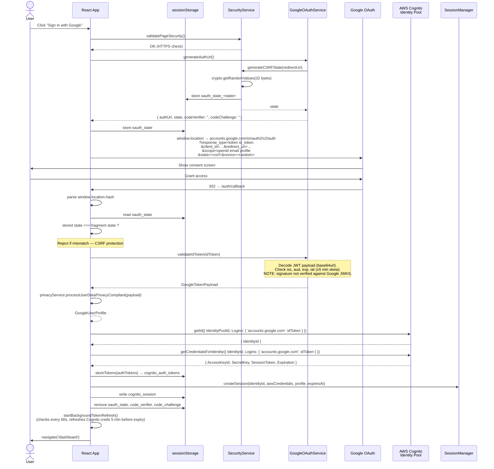

# Authentication Flow

End-to-end sequence of the authentication flow as actually implemented in `arena-book`.

> **Flow type:** OAuth 2.0 **implicit** flow (`response_type=token id_token`) federated through an AWS Cognito Identity Pool. Tokens are returned by Google in the URL fragment; there is no server-side code exchange. The codebase also contains an unreached `exchangeCodeForTokens` method for the Authorization Code + PKCE flow — it is wired through `AuthenticationService.completeGoogleAuth` but no UI path currently triggers it.

## Why implicit instead of PKCE

The OAuth Authorization Code + PKCE flow requires the browser to `POST` to `https://oauth2.googleapis.com/token` with `code_verifier`. Google's token endpoint does not respond to CORS preflight requests for the `application/x-www-form-urlencoded` `POST` from a browser when the client is configured as a Web application — Google expects a server-side exchange for that client type. Without a backend, the implicit flow is the practical option for a pure SPA. The trade-off: no `refresh_token`, so long-lived sessions require either silent re-auth (`prompt=none`) or a full re-login.

## Sequence diagram

## Storage contract

All authentication data lives in `sessionStorage` (cleared on tab close). No `localStorage`, no cookies. Keys are defined in `src/config/auth.ts` (`securityConfig`):

| Key | Lifetime | Contents |
|---|---|---|
| `oauth_state_<state>` | Until consumed or 10 min | CSRF state record `{ state, timestamp, redirectUri }` |
| `cognito_auth_tokens` | Until logout / tab close | `{ googleIdToken, cognitoCredentials, expiresAt }` |
| `cognito_session` | Until logout / tab close | `{ identityId, awsCredentials, googleProfile, expiresAt }` |
| `oauth_redirect_url` | Until login completes | Post-login redirect target (optional) |

## Security properties

| Property | Mechanism | Where implemented |
|---|---|---|
| CSRF protection | `state` parameter — 32 cryptographically random bytes (hex-encoded), one-time use, 10-minute expiry, stored both in-memory and in `sessionStorage` | `SecurityService.generateCSRFState` / `validateCSRFState` |
| Replay/binding | `nonce` parameter on the authorize URL (random per request) | `GoogleOAuthService.generateAuthUrl` |
| Token validation | Issuer (`accounts.google.com`), audience (your client ID), `exp` (±5 min skew), `iat` not in the future | `GoogleOAuthService.validateIdToken` |
| Token storage | `sessionStorage` only — never `localStorage`, never cookies | `TokenHandler`, `SessionManager` |
| HTTPS enforcement | Page-load check + outbound URL check, gated by `REACT_APP_HTTPS_ONLY` | `SecurityService.validatePageSecurity` / `enforceHTTPS` |
| Credential rotation | `TokenRefreshManager` calls `cognitoIdentity.getCredentialsForIdentity` every 60 s, refreshing 5 min before expiry; 3 consecutive failures triggers `onReAuthenticationRequired` | `TokenRefreshManager` |

## Known gaps

These are deliberate trade-offs in the current implementation. If you replicate this approach, decide explicitly whether to keep or close them.

1. **No JWT signature verification.** `validateIdToken` decodes the payload and checks claims but does not verify the signature against Google's JWKS (`https://www.googleapis.com/oauth2/v3/certs`). Since the token is received via a `window.location` redirect from `accounts.google.com` over TLS, an attacker would need to compromise TLS to forge a token — but defence-in-depth says verify the signature anyway. Use `jose` or `jsonwebtoken` + Google's JWKS for production.
2. **No Google refresh token.** Implicit flow does not issue one. `TokenRefreshManager` refreshes the *Cognito* credentials using the Google ID token Cognito already has, but once the Google ID token itself expires (1 h) there is no silent renewal path — the user must re-authenticate. To get longer sessions, either:
   - Switch to Authorization Code + PKCE *with a backend* that holds the `client_secret` and refresh token, **or**
   - Trigger a silent re-auth by opening Google's authorize URL with `prompt=none` in a hidden iframe (only works while the user's Google session is still valid).
3. **No PKCE on the implicit flow.** PKCE does not apply to `response_type=token id_token` — there is no code to intercept. The `code_verifier` / `code_challenge` returned by `generateAuthUrl` are empty strings.
4. **State stored client-side only.** The `state` parameter is stored in `sessionStorage` on the same browser that initiates the flow. This is sufficient for CSRF protection in a SPA but means a stolen browser session can replay it within the 10-minute window.

## Files involved

| Concern | File |
|---|---|
| Orchestration | `src/services/AuthenticationService.ts` |
| Building the Google authorize URL, validating the ID token | `src/services/GoogleOAuthService.ts` |
| Exchanging the ID token for AWS credentials | `src/services/CognitoIdentityService.ts` |
| State (CSRF), HTTPS enforcement | `src/services/SecurityService.ts` |
| `sessionStorage` token persistence | `src/services/TokenHandler.ts` |
| In-memory session | `src/services/SessionManager.ts` |
| Background credential refresh | `src/services/TokenRefreshManager.ts` |
| Mapping `id_token` payload → app profile | `src/services/PrivacyService.ts` |
| Parsing the callback fragment / query | `src/components/LoginScreen.tsx` (`processOAuthCallback`) |
| Config and storage-key constants | `src/config/auth.ts` |

## Replicating this in a new project

See:
- [`setup-google.md`](./setup-google.md) — Google Cloud Console steps
- [`setup-cognito.md`](./setup-cognito.md) — AWS Cognito Identity Pool + IAM policy steps
